# Hangman Game - Portfolio Project 3
This hamngman game is a python terminal game, which runs in the mock terminal on Heroku.

Users can start the game after they have entered their username for the game. Users are given an option to start the game, view rules and see the leaderboard. Once the game has started the user is presented with blank lines to show the missing letters. The number of blank lines shows how many letters need to be guessed by user. The user has 6 lives to guess the word. For every wrong word or letter guessed, the player loses 1 life. The incorrect guesses are displayed to the user so they can keep track of what they have already guessed.

If the user guesses a word correctly, they gain 10 points. They can continue to keep guessing to be placed in the top 5 players in the leaderboard. The more word they guess without losing, the higher their points will be. Once the player runs out of life and fails to guess the word, the game ends and the player has to start a new game. Once the game has ended, the leaderboard is shown to the user to check if they've made it in the top 5.

The live link to the site: [Live Link to the site](https://hangman-game-py.herokuapp.com/)

- __Flowchart__
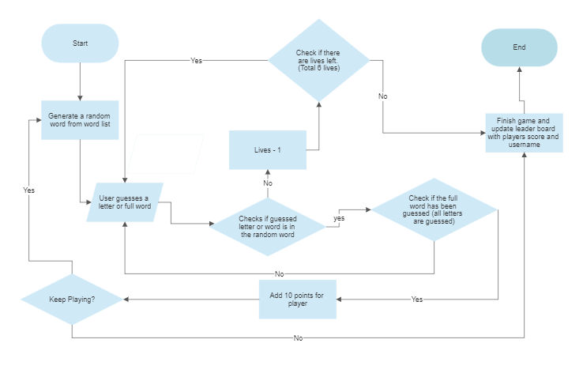
- The flowchart was used to plan the game so it would be easier to follow the steps to write the code for it.

## __Features__
### Existing Features
-__Welcome page__
- When the user runs the program a welcome message is displayed to them, then they are asked to pick one 0f the 3 options:
    1. Start Game
    2. Rules
    3. Highscores

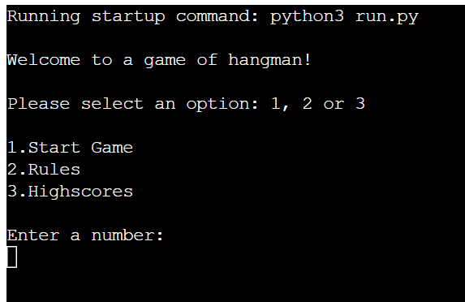

-__Start Game__
- If the user chooses to start the game, they are instructed to enter a username. If the user enters an invalid username, the game tells them to enter a valid username which is atleat 3-10 characters long. The game also doesn't accept empty spaces as a username.

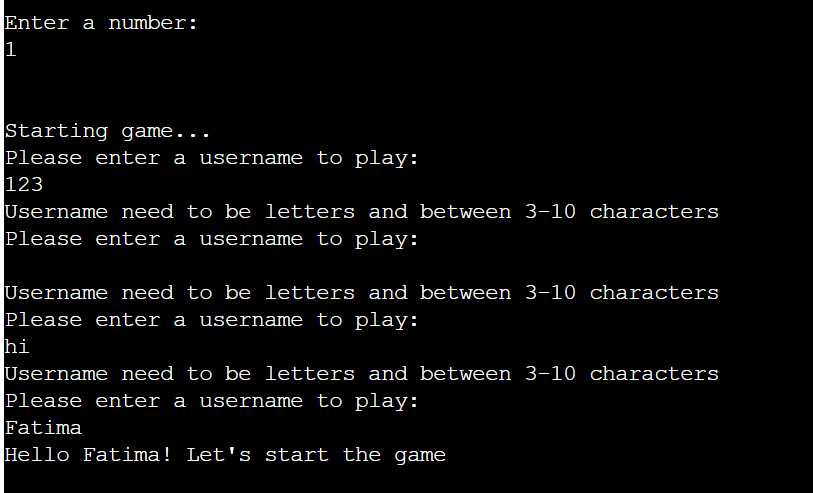

-__Hangman Game__
- When the game has started, the user is shown blank lines to display the missing letters. They are shown how many lives they have and the empty list of incorrect guesses as the user has not yet made any guesses. 
- Once the user has entered their guess, they are shown a message which tells them if their guess was correct or not. If it is wrong they are shown an image of a man forming.

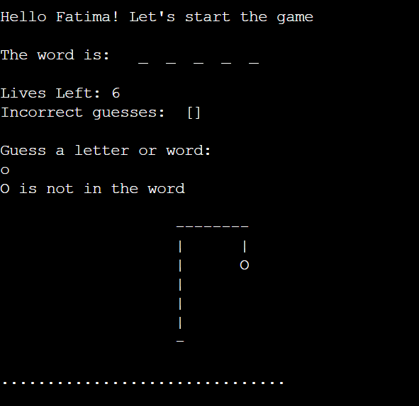

- The incorrect list is updated with the guessed letter. Their lives go down by one with each incorrect guess.

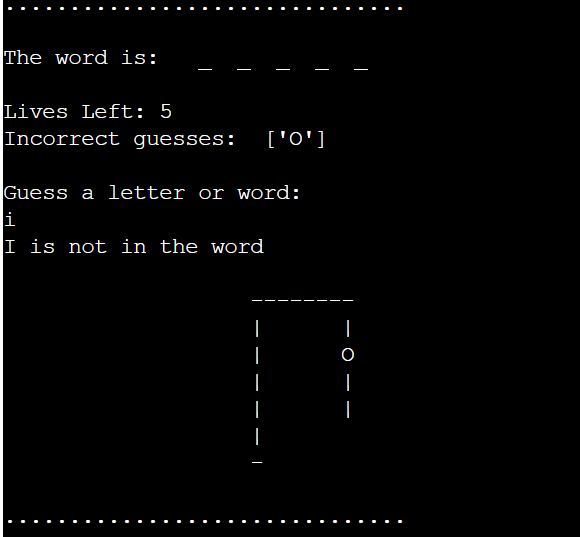

- If user has made a correct guess the blank lines are replaced with the correct letter. 

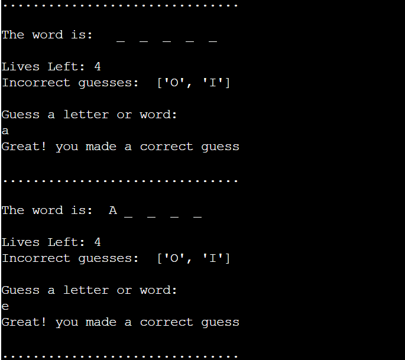
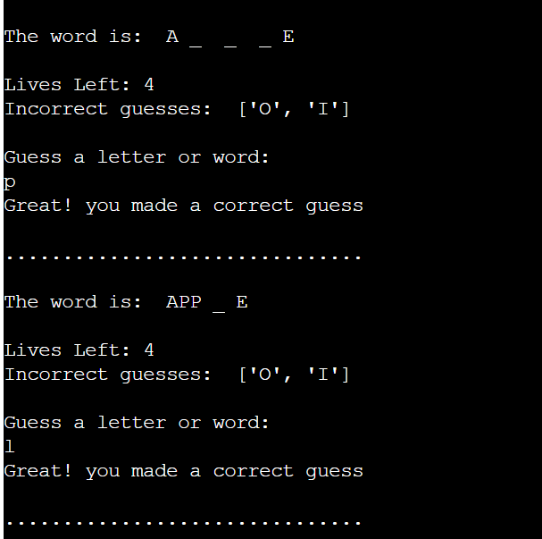

- Once the user has guessed the full word they are shown how many lives they were left with and their incorrect guesses. A winning message is displayed and their points are shown to them.

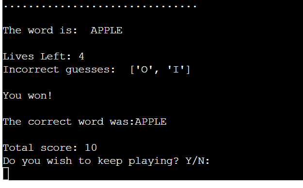

- The user is then given the option to play again to increase their score or they can enter 'N' and quit.
- The game doesn't accept invalid inputs and only accepts "Y" or "N" as an option.

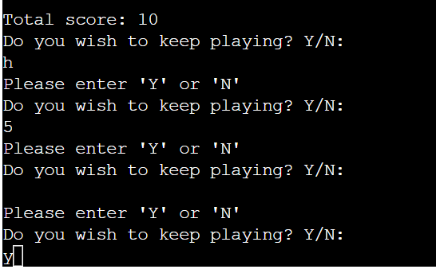

- After getting the second word correctly your score adds up to 20. The score increases by 10 points for every correct word.
- The user is asked again if they would like to continue playing.

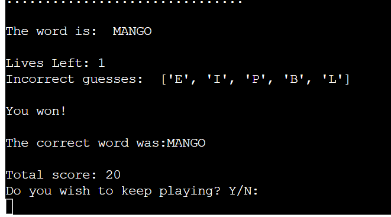

- If the user wishes to stop playing and enters 'N'. The game finishes and a Thank you message is displayed. The leaderboard is updated and the high scores are displayed for the user.

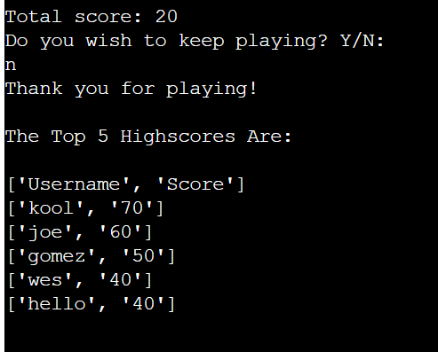

## __Technologies Used__

### Languages Used
- [Python](https://en.wikipedia.org/wiki/Python_(programming_language)) was the only language used to create the program.

### Frameworks, Libraries and Programs Used

- [random](https://docs.python.org/3/library/random.html) was used to generate a random word from the list of words.
- [gspread](https://docs.gspread.org/en/v5.7.0/) was used to store the players name and points. It is used to display the top 5 highscore in the leaderboard.
- [Smartdraw](https://www.smartdraw.com/flowchart/flowchart-maker.htm) was used to create the flowchart.
- [Git](https://git-scm.com/) was used for version control.
- [Github](https://github.com/) was used to save and store the project's code.

## __Testing__

I have manually tested this project by doing the following:
- I had my family and friends play the game and test it.
- I gave invalid inputs, the game doesn't accept them and asks the user to enter a valid input.
- When given an integer while guessing the word, the game doesn't accept the input and tells the user to enter a letter or guess the full word.
- The game checks that the username is 3-10 characters long.

### Validator Testing
- PEP8
    - No errors were returned from [PEP8](https://pep8ci.herokuapp.com/)

### Bugs
- Solved Bugs
    - When the player guessed the full word, the game was accepting it as a correct guess when it was wrong eg. the word was 'cat' but if the user guessed 'bat', the game would accept it based on the matching length. This was fixed by checking if the length and characters, both matched the word.
    - The game was allowing the user to enter any character for the yes and no option, Y/N. This was fixed by putting the options in a while loop so only the option would keep repeating until the user picked either 'Y' or 'N'.

- Unsolved Bugs
    - No bugs remaining.

## __Deployment__

This project was deployed using Code Institute's mock terminal for Heroku.

- Before going on Heroku, these are the steps that I followed:
    - We neede heroku to install some dependencies. The list of dependencies go in the requirements.txt file.
    - To create our list of requirements, we  use the following command in the terminal: 'Pip3 freeze > requirements.txt'.
    - We need to then commit and push these changes to GitHub.
    - After this, set up your account on Heroku.

- Deployment steps are as follows, after account setup:
    - Select New in the top-right corner of your Heroku Dashboard, and select Create a new app from the dropdown menu.
    - Choose a unique app name and then set the region to Europe, then click on create an app.
    - Go on settings, click Reveal Config Vars, and set the value of KEY to CREDS, and for the value add the data from your creds.json file then select add.
    - Scroll down to add Buildpacks. Select Python first, then Node.js second as the order of the buildpacks is important.
    - Now, go on deploy and select GitHub in the deployment method. Search for your repository and then click connect.
    - Scroll down to the automatic and manual deploy section and select either one of them. Once deployment is finished, click view button and run the program.